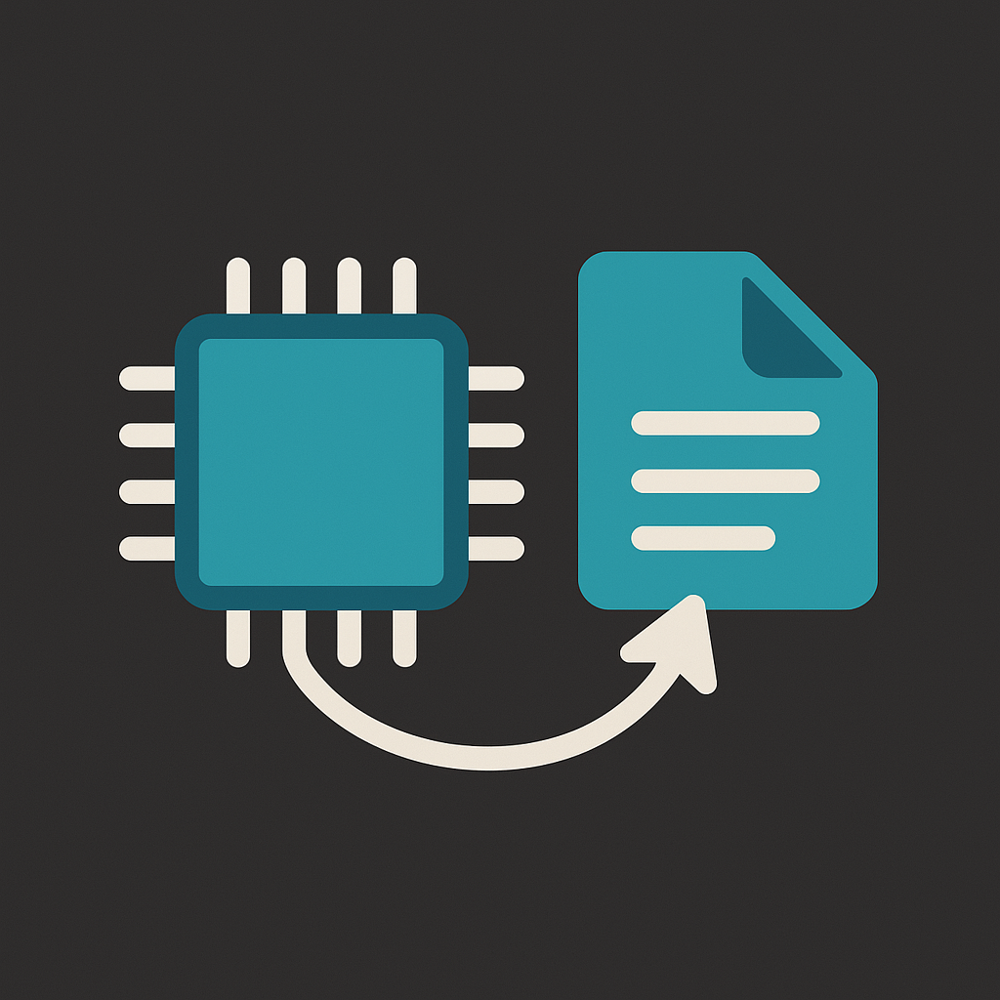

# MLModel Converter Tool

A simple Python tool for converting Hugging Face NLP models into Apple's Core ML format (`.mlmodel` or `.mlpackage`) for seamless integration into iOS/macOS apps, running inference on device.

<p align="center">
  
</p>


---

## Overview

This converter allows you to quickly transform pre-trained Hugging Face models (such as GPT-2 for text generation) into Core ML models suitable for on-device inference on Apple devices.

## Prerequisites

- Python 3.12+
- [uv](https://github.com/astral-sh/uv) for dependency management

## Setup

Clone and initialize the project:

```bash
git clone <repo_link>
cd mlmodel-converter
uv install
```

## Usage

### Converting a Hugging Face model

```bash
uv run python main.py
```

### Parameters

The cli will prompt you to enter the following parameters:

- `model_name`: The Hugging Face model name to convert (e.g., 'sarahai/your-inspiration')
- `file_extension`: The target file extension to use for the output Core ML model (mlmodel or mlpackage)
- `output_filename`: The output Core ML model filename (without .mlmodel or .mlpackage extension)

### Output

This generates a .mlmodel or .mlpackage file in the project directory (e.g., `<output_filename>.mlmodel` or `<output_filename>.mlpackage`) ready for integration into Xcode.

### Integration into Xcode

Drag the generated .mlmodel file into your Xcode project’s file navigator. Xcode automatically generates a Swift class to interact with the model.

## Contributing

Contributions are welcome! Please open an issue or submit a pull request.

## License

[MIT](https://choosealicense.com/licenses/mit/) @ [dtellz](https://github.com/dtellz)
 